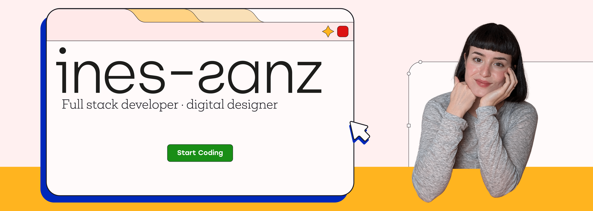

<h1 align="center"><b>Hi there! I'm Inés </b></h1>
 

 

# 👩🏻‍💻 About Me:

<ul style="font-size:18px;">
  <li>💻 I’m currently coursing a <b>Full Stack</b> Bootcamp.</li>
  <li>🙋🏻 I've experience as a <b>graphic and web designer</b>.</li>
  <li>💡 I've knowledge about <b>UI/UX</b>.</li>
  <li>☝🏼 Fun fact: I'm actually a Fine Arts graduate.</li>
  <li>📫 How to reach me: email me at <a href="mailto:inessanzmm@gmail.com">inessanzmm@gmail.com</a></li>
</ul>

 

I’m a Fine Arts graduate, which may not seem directly related to coding, but it has taught me the importance of <b>attention to detail, commitment, and always striving for excellence.</b>✨ My background has helped me develop <b>strong organizational and planning skills</b>. After finishing my degree, I focused on digital design and had the opportunity to work in that field. However, I felt the need for a new challenge, which led me to explore coding. 🎯 I believe that combining <b>back-end, front-end, design, and UX/UI</b> will help me build a well-rounded and versatile skill set.

I may be new to coding, but I’m highly experienced in <b>problem-solving, quick learning</b> (something I’m particularly good at), and thinking creatively.💡 I’m always up for new challenges and excited to see where this journey will take me!✈️
 

 

# 📊 GitHub Analytics:

<!--
<!--

**Ines-sanz/ines-sanz** is a ✨ _special_ ✨ repository because its `README.md` (this file) appears on your GitHub profile.

Here are some ideas to get you started:
-->
